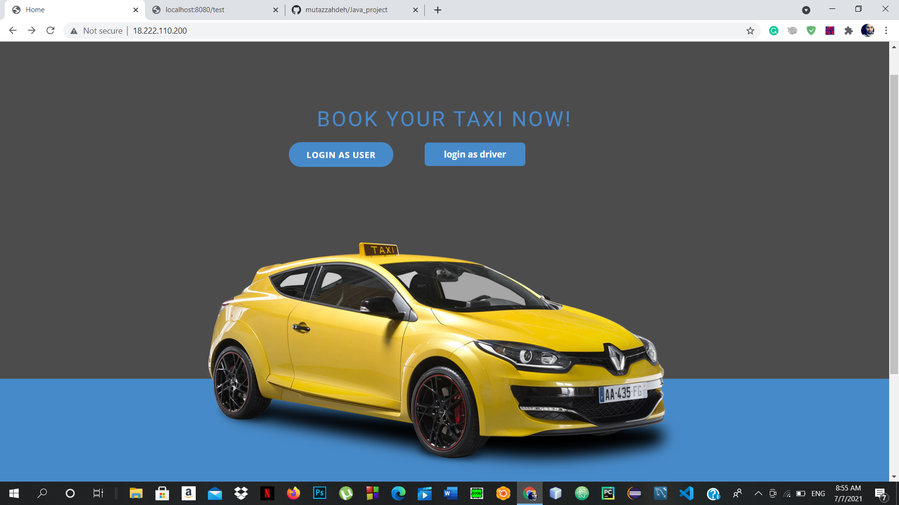

Done by (Mohammad Raddad, mutaz zahdeh , mohammad hammoze) - Axsos Academy, Ramallah - Palestine]

•Introduction: The idea of wasslni is for the difficult situation in transportation so we invented this idea to make it easier and it's easy to use and it can create a lot of jobs in Palestine

The project contains 9 HTML pages including their CSS (style sheets), responsive pages applied, and we plan to use some APIs like Google Maps to get a location and Api for sending Email messages.

Validation is available for password as the email is also if the user is not registered, he could register and use the website as he wants.

we used Spring Boot to create the backend for this website, and we had relations like many to many between user and driver and trips, and it has two roles 1- driver 2- user, we will and third it like an admin.

